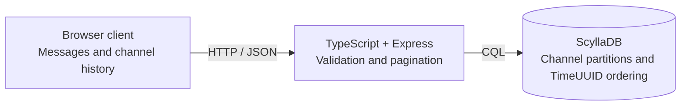

# Felipe Alves

Software Engineer based in Brazil, with 4+ years of professional experience
building APIs, integrations, and business applications with Node.js,
TypeScript, and React.

I work across backend services and frontend interfaces, with a focus on
reliable integrations, payment workflows, and tools that reduce manual work.

## Selected experience

- Architected an asynchronous enrollment pipeline with persisted state,
  exponential backoff, idempotent recovery, and failure isolation.
- Built a payment integration layer with 29 REST endpoints covering
  PIX, boleto, cards, tokenization, payment links, and reconciliation.
- Standardized integrations across six external platforms using
  reusable services, centralized retries, RabbitMQ, and webhooks.
- Led a five-person engineering team delivering public grant and
  financial management systems.
- Built business integrations and operational automation that saved
  250+ hours of manual work annually.

## Tech stack

- Backend: Node.js, TypeScript, JavaScript, Express.js
- APIs and integrations: REST, OpenAPI, OAuth 2.0, RabbitMQ, webhooks
- Databases: MySQL, PostgreSQL
- Frontend and tooling: React, Docker, Git, GitHub Actions
- Enterprise systems: Oracle APEX, PL/SQL

## Selected projects

### [AI Pulse](https://github.com/xfelipealves/AI-Pulse)

A macOS menu bar app that brings AI coding usage limits into one place.

- Tracks usage across providers including Codex, Claude Code, and Cursor.
- Supports multiple accounts and configurable refresh intervals.

**Built with:** TypeScript, React, Electron 
[Explore the code](https://github.com/xfelipealves/AI-Pulse) · [Download for macOS](https://github.com/xfelipealves/AI-Pulse/releases/latest)

---

### [SystemMonitor](https://github.com/xfelipealves/SystemMonitor)

A native macOS menu bar app for monitoring CPU, memory, and disk usage.

- Groups processes by application and displays resource usage.
- Supports Apple Silicon and Intel Macs.

**Built with:** Swift, native macOS APIs, no external dependencies 
[Explore the code](https://github.com/xfelipealves/SystemMonitor) · [Download for macOS](https://github.com/xfelipealves/SystemMonitor/releases/latest)

AI Pulse uses demo accounts; the SystemMonitor preview is an illustration.

---

### [Mini Discord](https://github.com/xfelipealves/mini-discord)

An educational chat API for exploring ScyllaDB data modeling and consistency.

- Cursor pagination, configurable consistency, and LWT-based deduplication.
- Docker Compose setups for single-node and three-node database experiments.

**Built with:** TypeScript, Express, ScyllaDB, Docker 
[Explore the code and architecture](https://github.com/xfelipealves/mini-discord)

## Contact

[Connect with me on LinkedIn](https://www.linkedin.com/in/felipe-camilo-alves)
